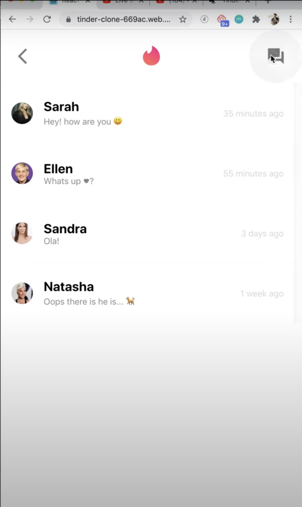
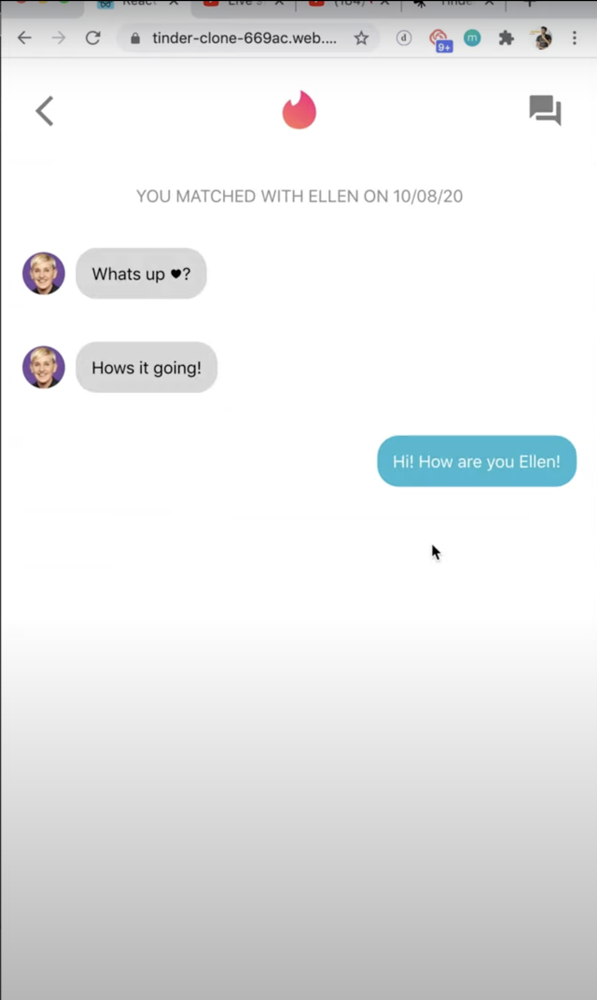

# Tinder Clone (Archived)

**Status**: This repository is archived and no longer maintained. It is preserved as a portfolio project to showcase early full-stack development skills. For my latest work, please visit my [GitHub profile](https://github.com/Usama-Imtiaz-07).

## Overview
This project is a full-stack dating application inspired by Tinder, featuring user authentication, swipe-based matching, and real-time messaging. Built as a learning exercise, it demonstrates proficiency in developing a modern web application using the MERN stack (MongoDB, Express.js, React, Node.js) and Firebase.

## Features
- **User Authentication**: Secure login with Google via Firebase Authentication.
- **Swipe Interface**: Intuitive swipe-left-to-pass and swipe-right-to-like functionality for user profiles.
- **Real-Time Chat**: Seamless messaging between matched users.
- **Profile Management**: Create and customize user profiles with images and bios.
- **Responsive Design**: Mobile-friendly UI built with React and styled with Tailwind CSS.

## Tech Stack
- **Frontend**: React, Tailwind CSS, React Tinder Card
- **Backend**: Node.js, Express.js, MongoDB, Mongoose
- **Authentication**: Firebase Authentication
- **API Testing**: Postman

## Installation
This project is archived and not intended for active use due to outdated dependencies. For reference, the following steps outline how to set it up locally:

### Prerequisites
- Node.js (v16 or higher)
- MongoDB (local or Atlas)
- Firebase account

### Steps
1. Clone the repository:
   ```bash
   git clone https://github.com/your-username/tinder-clone.git
   cd tinder-clone
   ```
2. Set up environment variables in `.env` files for the frontend (Firebase config) and backend (MongoDB URI, port).
3. Install dependencies:
   ```bash
   cd backend
   npm install
   cd ../frontend
   npm install
   ```
4. Run the backend (`npm start` in `backend`, default port: 8001).
5. Run the frontend (`npm start` in `frontend`, default port: 3000).

**Note**: Due to the project's age, you may encounter compatibility issues with modern dependencies.

## Screenshots

#### Swipe Interface 


#### Chat Interface 


#### Message Interface 


*Note*: Screenshots reflect the implemented UI, showcasing the project's functionality.

## Status
This repository is archived and serves as a portfolio piece to highlight early experience with full-stack development.

## Contact
For inquiries or to view my latest projects, connect with me via [GitHub](https://github.com/Usama-Imtiaz-07) or [Gmail](mailto:osamaimtiaz677@gmail.com).
